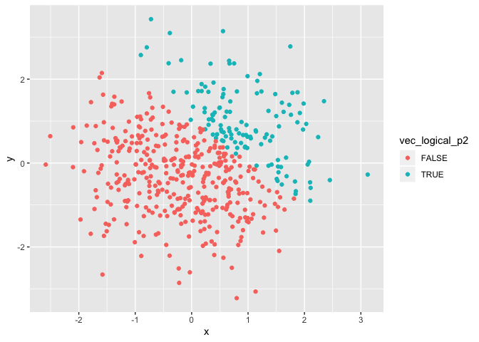
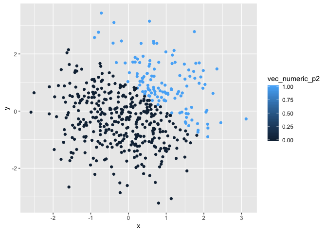
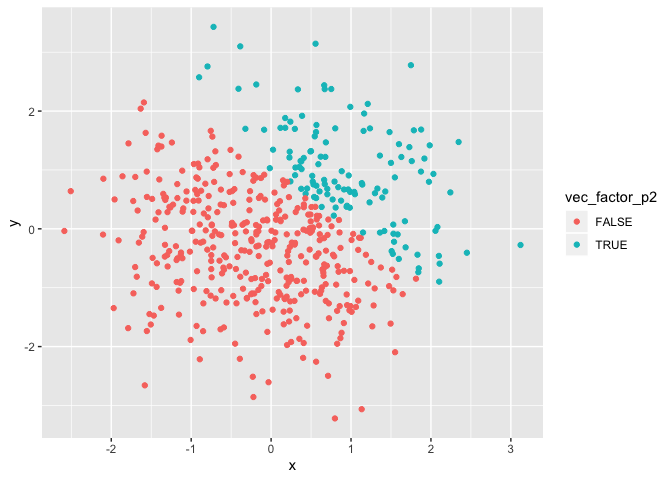

Data Science - Homework \#1
================
Jon Brock - JPB2210

  - [Problem \#1](#problem-1)
  - [Problem \#2](#problem-2)
  - [Bonus Content](#bonus-content)

## Problem \#1

###### (*25 points*)

##### *Create a data frame with specific inclusions:*

``` r
set.seed(134) #I set a random seed for the sake of consistency and reproducibility
prob1_df <- tibble(
    vec_numeric = rnorm(8),
    vec_logical = vec_numeric > 0,
    vec_character = c("beat", "cream", "fold", "glaze", "knead", "score", "whip", "whisk"),
    vec_factor = factor(c("good", "neutral", "bad", "good", "neutral", "bad", "good", "bad"))
)
```

-----

##### *Taking the mean value of each vector within our data frame:*

The mean value of `vec_numeric` is 0.186.  
The mean value of `vec_logical` is 0.5.  
The mean value of `vec_character` is NA.  
The mean value of `vec_factor` is NA.

We see that we are unable to take the mean value from `vec_character`
and `vec_factor`. Additionally, while we did take a mean value from
`vec_logical` it’s merely a mean of 0’s and 1’s.

``` r
#THIS SECTION PENDING COMPLETION
```

-----

## Problem \#2

###### (*25 points*)

##### *Create a data frame with specific inclusions:*

``` r
set.seed(53) #I set a random seed for the sake of consistency and reproducibility
prob2_df <- tibble(
    x = rnorm(500),
    y = rnorm(500),
    vec_logical_p2 = x + y > 1,
    vec_numeric_p2 = as.numeric(vec_logical_p2),
    vec_factor_p2 = as.factor(vec_logical_p2)
)
```

Let me tell you a few fun facts about `prob2_df`:

1.  The data frame has 500 rows and 5 columns  
2.  The variable ‘x’ has:  

<!-- end list -->

  - a mean value of 0.057  
  - a median value of 0.153  
  - a standard deviation of 0.975  

<!-- end list -->

1.  The proportion of cases for which `x + y > 1` is 0.248

-----

``` r
p8105_hw1_plot1
```



``` r
p8105_hw1_plot2
```



``` r
p8105_hw1_plot3
```



-----

##### *Save the first generated plot to the project directory*

``` r
ggsave(filename = "hw1_prob2_plot1.png", plot = p8105_hw1_plot1)
```

    ## Saving 7 x 5 in image

-----

## Bonus Content

I don’t know when or how I found this photo, but it’s **AMAZING**.

<center>


</center>
